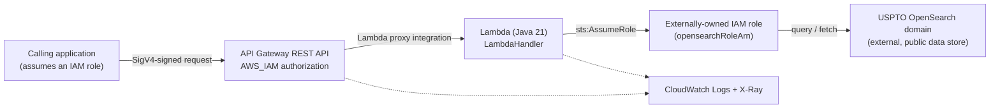

# USPTO OpenSearch Connector CDK

AWS CDK v2 (TypeScript) app that deploys [`uspto-opensearch-connector`](https://github.com/samtindal/uspto-opensearch-connector) — a Java 21 Lambda that fronts a USPTO OpenSearch data store — behind an IAM-authenticated API Gateway REST API.

## Architecture



### Routes

| Method | Path | Activity |
|---|---|---|
| GET | `/getRelatedRecordIds` | `GetRelatedRecordIdsActivity` |
| GET | `/getRecordDetails` | `GetRecordDetailsActivity` |

Both routes require AWS SigV4-signed requests from a principal granted `execute-api:Invoke` on the API.

## Repository layout

```
.
├── bin/app.ts                          # CDK app entrypoint
├── lib/
│   ├── config.ts                       # reads opensearchRoleArn from CDK context
│   └── uspto-connector-stack.ts        # Lambda + IAM + API Gateway
├── test/                               # aws-cdk-lib/assertions unit tests
├── vendor/uspto-opensearch-connector/  # git submodule: the Lambda's Java source
├── .github/workflows/cdk.yml           # synth/test on PR, deploy on merge to main
├── cdk.json / package.json / tsconfig.json / jest.config.js
```

## Prerequisites

- Node.js 20+
- Docker, running — used to build the Lambda's fat jar (via `gradle:8-jdk21`) during `cdk synth`/`cdk deploy`
- AWS CLI configured with credentials for the target account
- The ARN of an IAM role the Lambda can assume to reach the USPTO OpenSearch domain

## Setup

```bash
git clone --recurse-submodules git@github.com:samtindal/uspto-opensearch-connector-cdk.git
cd uspto-opensearch-connector-cdk
npm install
```

Already cloned without submodules?
```bash
git submodule update --init --recursive
```

## Deploy

```bash
npx cdk deploy -c opensearchRoleArn=arn:aws:iam::<account-id>:role/<role-name>
```

`opensearchRoleArn` is required — synth fails with a clear error if it's missing.

## Test

```bash
npm test
```

Unit tests never invoke Docker (they set the `aws:cdk:bundling-stacks` context flag to skip real asset bundling). To validate the real Lambda packaging end-to-end, run `npx cdk synth -c opensearchRoleArn=...` directly.

## CI/CD

`.github/workflows/cdk.yml` runs `npm test` and `cdk synth` on every pull request, and deploys on merge to `main` once the `AWS_DEPLOY_ROLE_ARN` and `OPENSEARCH_ROLE_ARN` secrets and the `AWS_REGION` variable are configured on the repository.

## Related

- [`uspto-opensearch-connector`](https://github.com/samtindal/uspto-opensearch-connector) — the Lambda's Java source, included here as a git submodule at `vendor/uspto-opensearch-connector`.
