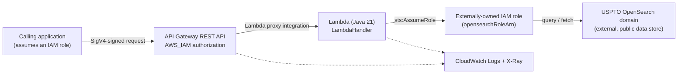

# USPTO OpenSearch Connector CDK Implementation Plan

> **For agentic workers:** REQUIRED SUB-SKILL: Use superpowers:subagent-driven-development (recommended) or superpowers:executing-plans to implement this plan task-by-task. Steps use checkbox (`- [ ]`) syntax for tracking.

**Goal:** Build the AWS CDK v2 (TypeScript) app in this repo that deploys `samtindal/uspto-opensearch-connector`'s Java 21 Lambda behind an IAM-authenticated API Gateway REST API.

**Architecture:** A single `UsptoConnectorStack` creates one Lambda (packaged from a git submodule of the connector's source via Docker-based Gradle bundling), one REST API with two IAM-authorized `GET` routes proxying to it, and the supporting IAM/CloudWatch/X-Ray plumbing. The connector's own repo gets one small, separately-scoped PR (missing imports + Shadow plugin) since it doesn't currently compile into a Lambda-deployable jar.

**Tech Stack:** AWS CDK v2 (`aws-cdk-lib` ^2.270.0, TypeScript ~7.0.2, `tsx`, Jest 30 + `@swc/jest`), Docker (`gradle:8-jdk21` bundling image), GitHub Actions, `gh` CLI.

**Spec:** `docs/superpowers/specs/2026-09-27-uspto-connector-cdk-design.md`

## Global Constraints

- CDK v2, TypeScript (per approved design).
- Single stack, no `Stage` construct — structured so one can be added later without a rewrite.
- Lambda `runtime: lambda.Runtime.JAVA_21`; handler is the fully-qualified class `main.java.com.samtindal.usptoconnector.handler.LambdaHandler` (verified against the actual compiled `.class` path inside the built jar — see Task 6).
- REST API (not HTTP API v2); both routes use `apigateway.AuthorizationType.IAM`.
- Connector source lives at `vendor/uspto-opensearch-connector` as a git submodule pinned to a specific commit — never a sibling-checkout assumption.
- `opensearchRoleArn` is read from CDK context only (`loadConfig`); synth must fail with a clear error if it's absent.
- CloudWatch log retention is explicit (`ONE_MONTH`), never the "never expire" default.
- X-Ray tracing enabled on both the Lambda and the API stage.
- Commit messages: short, no `Co-Authored-By` trailer (per user instruction for this session).

## Review Focus

- Missing `opensearchRoleArn` context context → `loadConfig` must throw a message naming the flag, not a generic CDK/undefined error. Covered by Task 4's tests and Task 5's stack test.
- API Gateway stage access logging enabled without an account-level CloudWatch role configured → real deploys fail with "CloudWatch Logs role ARN must be set in account settings." Covered by Task 5's `AWS::ApiGateway::Account` assertion (the resource existing is what prevents this failure).
- IAM authorization silently defaulting to `NONE` on one route while the other is correctly `AWS_IAM` (easy copy-paste miss across two `addMethod` calls) → Task 5 asserts both methods' `AuthorizationType` explicitly, not just resource existence.
- Handler string typo vs. the jar's actual compiled class path → causes a runtime `ClassNotFoundException` with no synth-time signal. Covered by Task 6's direct jar-content inspection against the exact `LAMBDA_HANDLER` constant.
- Fresh clone without `git submodule update --init` → Docker bundling fails with an opaque "no such file or directory" from inside the container. Covered by the explicit guard in Task 5 and manually verified in Task 6.

---

## Task 1: Scaffold the CDK TypeScript project

**Files:**
- Create: `package.json`
- Create: `tsconfig.json`
- Create: `cdk.json`
- Create: `jest.config.js`
- Create/modify: `.gitignore` (merge with existing, if any)
- Create: `bin/app.ts`
- Create: `lib/uspto-connector-stack.ts`
- Test: `test/uspto-connector-stack.test.ts`

**Interfaces:**
- Produces: `UsptoConnectorStack` (exported class from `lib/uspto-connector-stack.ts`, extends `Stack`, constructor signature `(scope: Construct, id: string, props?: StackProps)`), currently an empty stack. Task 5 fills in its body.

- [ ] **Step 1: Generate a reference scaffold to copy from**

Run this in a scratch directory (not the repo) to get tooling files that exactly match the currently-installed CDK CLI — do not hand-type `cdk.json`'s context block from memory, it changes across versions:

```bash
mkdir -p /tmp/cdk-scaffold-ref && cd /tmp/cdk-scaffold-ref && npx --yes aws-cdk@2.1143.0 init app --language typescript
```

- [ ] **Step 2: Copy and adapt the generated tooling files into the repo**

From `/tmp/cdk-scaffold-ref`, copy `cdk.json`, `tsconfig.json`, `jest.config.js`, `.gitignore`, and `package.json` into the repo root. Do NOT copy `bin/cdk-scaffold.ts`, `lib/cdk-scaffold-stack.ts`, `test/cdk-scaffold.test.ts`, `README.md`, `.npmignore`, `package-lock.json`, or the generated `.git` directory — this repo already has its own git history and its own README.

Edit the copied `package.json`: change `"name": "cdk-scaffold"` to `"name": "uspto-opensearch-connector-cdk"`.

Edit the copied `cdk.json`: change the `"app"` line from:
```
"app": "npx tsc && npx tsx bin/cdk-scaffold.ts",
```
to:
```
"app": "npx tsc && npx tsx bin/app.ts",
```

- [ ] **Step 3: Write the stack skeleton**

`lib/uspto-connector-stack.ts`:
```typescript
import { Stack, StackProps } from 'aws-cdk-lib/core';
import { Construct } from 'constructs';

export class UsptoConnectorStack extends Stack {
  constructor(scope: Construct, id: string, props?: StackProps) {
    super(scope, id, props);
  }
}
```

- [ ] **Step 4: Write the app entrypoint**

`bin/app.ts`:
```typescript
#!/usr/bin/env node
import * as cdk from 'aws-cdk-lib/core';
import { UsptoConnectorStack } from '../lib/uspto-connector-stack';

const app = new cdk.App();

new UsptoConnectorStack(app, 'UsptoConnectorStack', {
  env: {
    account: process.env.CDK_DEFAULT_ACCOUNT,
    region: process.env.CDK_DEFAULT_REGION,
  },
});
```

- [ ] **Step 5: Write a smoke test**

`test/uspto-connector-stack.test.ts`:
```typescript
import { App } from 'aws-cdk-lib/core';
import { UsptoConnectorStack } from '../lib/uspto-connector-stack';

describe('UsptoConnectorStack', () => {
  test('synthesizes without error', () => {
    const app = new App();
    expect(() => new UsptoConnectorStack(app, 'TestStack')).not.toThrow();
  });
});
```

- [ ] **Step 6: Install and verify**

```bash
npm install
npm run build
npm test
```

Expected: `npm run build` (type-check) passes with no errors; `npm test` reports 1 passed test suite, 1 passed test.

- [ ] **Step 7: Commit**

```bash
git add package.json package-lock.json tsconfig.json cdk.json jest.config.js .gitignore bin/app.ts lib/uspto-connector-stack.ts test/uspto-connector-stack.test.ts
git commit -m "Scaffold CDK TypeScript project"
```

---

## Task 2: Add the connector source as a git submodule

**Files:**
- Create: `.gitmodules`
- Create: `vendor/uspto-opensearch-connector/` (submodule checkout)

**Interfaces:**
- Produces: a checked-out copy of `samtindal/uspto-opensearch-connector` at `vendor/uspto-opensearch-connector`, pinned to commit `312b7f1520e6aeb3096877284a3abf2da6327c1` (current `main` HEAD as of this plan). Task 3 will update this pin after merging its PR. Task 5's stack code depends on this path existing with a `build.gradle` at its root.

- [ ] **Step 1: Add the submodule**

```bash
git submodule add git@github.com:samtindal/uspto-opensearch-connector.git vendor/uspto-opensearch-connector
```

- [ ] **Step 2: Verify the pin**

```bash
git -C vendor/uspto-opensearch-connector rev-parse HEAD
```

Expected: `312b7f1520e6aeb3096877284a3abf2da6327c1` (or a later commit if `main` has moved since this plan was written — that's fine, just note the actual SHA).

- [ ] **Step 3: Commit**

```bash
git add .gitmodules vendor/uspto-opensearch-connector
git commit -m "Add uspto-opensearch-connector as a submodule"
```

---

## Task 3: Fix the connector's compile errors and add Shadow plugin packaging

The connector repo does not currently compile: `LambdaHandler.java` and both activity classes reference types from sibling packages without importing them. This must be fixed before a Lambda-deployable jar can exist. Bundled into the same PR per explicit user approval (2026-09-27): both the import fix and the Shadow plugin addition are minimal, additive, and both are prerequisites for a working jar.

**Files (all inside the `vendor/uspto-opensearch-connector` submodule, a separate git repo/remote):**
- Modify: `vendor/uspto-opensearch-connector/build.gradle`
- Modify: `vendor/uspto-opensearch-connector/src/main/java/com/samtindal/usptoconnector/handler/LambdaHandler.java`
- Modify: `vendor/uspto-opensearch-connector/src/main/java/com/samtindal/usptoconnector/activities/GetRelatedRecordIdsActivity.java`
- Modify: `vendor/uspto-opensearch-connector/src/main/java/com/samtindal/usptoconnector/activities/GetRecordDetailsActivity.java`
- Then modify (in the parent repo): `vendor/uspto-opensearch-connector` (submodule pointer bump)

**Interfaces:**
- Produces: `./gradlew`-free Docker-buildable target — `gradle shadowJar --no-daemon` run from the submodule root produces `build/libs/uspto-opensearch-connector-1.0-SNAPSHOT-all.jar`, containing `main/java/com/samtindal/usptoconnector/handler/LambdaHandler.class`. Task 5 and Task 6 depend on this exact command and output path.

- [ ] **Step 1: Create a branch inside the submodule**

```bash
cd vendor/uspto-opensearch-connector
git checkout -b add-shadow-jar-plugin
```

- [ ] **Step 2: Add the Shadow plugin to `build.gradle`**

Change:
```groovy
plugins {
    id 'java'
    id 'application'
}
```
to:
```groovy
plugins {
    id 'java'
    id 'application'
    id 'com.github.johnrengelman.shadow' version '8.1.1'
}
```

- [ ] **Step 3: Fix `LambdaHandler.java`'s missing imports**

Change:
```java
import com.amazonaws.services.lambda.runtime.events.APIGatewayProxyResponseEvent;
import org.slf4j.Logger;
```
to:
```java
import com.amazonaws.services.lambda.runtime.events.APIGatewayProxyResponseEvent;
import main.java.com.samtindal.usptoconnector.activities.GetRecordDetailsActivity;
import main.java.com.samtindal.usptoconnector.activities.GetRelatedRecordIdsActivity;
import main.java.com.samtindal.usptoconnector.client.OpenSearchClientWrapper;
import org.slf4j.Logger;
```
(both files are `src/main/java/com/samtindal/usptoconnector/handler/LambdaHandler.java`)

- [ ] **Step 4: Fix `GetRelatedRecordIdsActivity.java`'s missing import**

Change:
```java
import org.slf4j.Logger;
import org.slf4j.LoggerFactory;

import java.util.List;
```
to:
```java
import main.java.com.samtindal.usptoconnector.client.OpenSearchClientWrapper;
import org.slf4j.Logger;
import org.slf4j.LoggerFactory;

import java.util.List;
```

- [ ] **Step 5: Fix `GetRecordDetailsActivity.java`'s missing import**

Change:
```java
import org.slf4j.Logger;
import org.slf4j.LoggerFactory;
```
to:
```java
import main.java.com.samtindal.usptoconnector.client.OpenSearchClientWrapper;
import org.slf4j.Logger;
import org.slf4j.LoggerFactory;
```

- [ ] **Step 6: Build and verify the fat jar**

From `vendor/uspto-opensearch-connector`:
```bash
docker run --rm -v "$(pwd)":/workspace -w /workspace gradle:8-jdk21 gradle shadowJar --no-daemon
ls build/libs/
```

Expected: `BUILD SUCCESSFUL`, and `build/libs/uspto-opensearch-connector-1.0-SNAPSHOT-all.jar` exists (previously validated at ~5.9 MB).

- [ ] **Step 7: Commit, push, and open a PR**

```bash
git add build.gradle src/main/java/com/samtindal/usptoconnector/handler/LambdaHandler.java src/main/java/com/samtindal/usptoconnector/activities/GetRelatedRecordIdsActivity.java src/main/java/com/samtindal/usptoconnector/activities/GetRecordDetailsActivity.java
git commit -m "Add Shadow plugin and fix missing package imports"
git push -u origin add-shadow-jar-plugin
gh pr create --repo samtindal/uspto-opensearch-connector \
  --title "Add Shadow plugin and fix missing imports for Lambda packaging" \
  --body "$(cat <<'EOF'
## Summary
- Adds three missing imports across LambdaHandler, GetRelatedRecordIdsActivity, and GetRecordDetailsActivity — without them the project does not compile (the activity/client classes live in sibling packages and were never imported).
- Adds the Shadow plugin so \`gradle shadowJar\` produces a fat jar bundling aws-lambda-java-core, aws-lambda-java-events, slf4j/logback, and httpclient5 — required for AWS Lambda deployment, since none of these are on the Lambda Java runtime's classpath by default.

Needed to deploy this Lambda via the CDK package at [uspto-opensearch-connector-cdk](https://github.com/samtindal/uspto-opensearch-connector-cdk).

## Test plan
- [x] \`gradle shadowJar\` succeeds and produces \`build/libs/uspto-opensearch-connector-1.0-SNAPSHOT-all.jar\`
EOF
)"
```

- [ ] **Step 8: STOP — wait for explicit user confirmation before merging**

This PR is against a separate, real GitHub repository. Share the PR URL with the user and wait for their explicit go-ahead in chat before running the merge command below. Do not proceed to Step 9 without that confirmation.

- [ ] **Step 9: Merge and update the submodule pointer**

Once confirmed:
```bash
gh pr merge --repo samtindal/uspto-opensearch-connector --squash --delete-branch add-shadow-jar-plugin
cd vendor/uspto-opensearch-connector
git checkout main
git pull origin main
git rev-parse HEAD
cd ../..
git add vendor/uspto-opensearch-connector
git commit -m "Update connector submodule to shadow-jar commit"
```

---

## Task 4: Implement `loadConfig`

**Files:**
- Create: `lib/config.ts`
- Test: `test/config.test.ts`

**Interfaces:**
- Consumes: nothing beyond `constructs`' `Construct` type.
- Produces: `loadConfig(scope: Construct): StackConfig` and `interface StackConfig { readonly opensearchRoleArn: string }`, both exported from `lib/config.ts`. Task 5's stack calls `loadConfig(this)`.

- [ ] **Step 1: Write the failing tests**

`test/config.test.ts`:
```typescript
import { App, Stack } from 'aws-cdk-lib/core';
import { loadConfig } from '../lib/config';

describe('loadConfig', () => {
  test('throws a clear error when opensearchRoleArn context is missing', () => {
    const app = new App();
    const stack = new Stack(app, 'TestStack');
    expect(() => loadConfig(stack)).toThrow(/opensearchRoleArn/);
  });

  test('returns the ARN when context is present', () => {
    const app = new App({
      context: { opensearchRoleArn: 'arn:aws:iam::123456789012:role/opensearch-access' },
    });
    const stack = new Stack(app, 'TestStack');
    expect(loadConfig(stack)).toEqual({
      opensearchRoleArn: 'arn:aws:iam::123456789012:role/opensearch-access',
    });
  });
});
```

- [ ] **Step 2: Run tests to verify they fail**

```bash
npx jest test/config.test.ts
```

Expected: FAIL — `Cannot find module '../lib/config'`.

- [ ] **Step 3: Implement `loadConfig`**

`lib/config.ts`:
```typescript
import { Construct } from 'constructs';

export interface StackConfig {
  readonly opensearchRoleArn: string;
}

export function loadConfig(scope: Construct): StackConfig {
  const opensearchRoleArn = scope.node.tryGetContext('opensearchRoleArn');
  if (typeof opensearchRoleArn !== 'string' || opensearchRoleArn.length === 0) {
    throw new Error(
      "Missing required context value 'opensearchRoleArn'. Pass it with " +
        "`cdk deploy -c opensearchRoleArn=arn:aws:iam::<account>:role/<role-name>` " +
        'or add it to cdk.context.json.',
    );
  }
  return { opensearchRoleArn };
}
```

- [ ] **Step 4: Run tests to verify they pass**

```bash
npx jest test/config.test.ts
```

Expected: PASS, 2 passed tests.

- [ ] **Step 5: Commit**

```bash
git add lib/config.ts test/config.test.ts
git commit -m "Add context-based stack config loader"
```

---

## Task 5: Implement the full stack (Lambda, IAM, API Gateway)

**Files:**
- Modify: `lib/uspto-connector-stack.ts` (replace the Task 1 skeleton body)
- Modify: `test/uspto-connector-stack.test.ts` (replace the Task 1 smoke test)

**Interfaces:**
- Consumes: `loadConfig` and `StackConfig` from `./config` (Task 4).
- Produces: `UsptoConnectorStack` now creates real resources. No new exports beyond the existing class.

- [ ] **Step 1: Write the failing tests**

Replace `test/uspto-connector-stack.test.ts` entirely:
```typescript
import { App } from 'aws-cdk-lib/core';
import { Match, Template } from 'aws-cdk-lib/assertions';
import { UsptoConnectorStack } from '../lib/uspto-connector-stack';

function synthTemplate(context: Record<string, unknown> = {}): Template {
  const app = new App({
    context: {
      opensearchRoleArn: 'arn:aws:iam::123456789012:role/opensearch-access',
      'aws:cdk:bundling-stacks': [],
      ...context,
    },
  });
  const stack = new UsptoConnectorStack(app, 'TestStack');
  return Template.fromStack(stack);
}

describe('UsptoConnectorStack', () => {
  test('creates a Java 21 Lambda function with the connector handler', () => {
    const template = synthTemplate();
    template.hasResourceProperties('AWS::Lambda::Function', {
      Runtime: 'java21',
      Handler: 'main.java.com.samtindal.usptoconnector.handler.LambdaHandler',
    });
  });

  test('grants the Lambda role permission to assume the OpenSearch role', () => {
    const template = synthTemplate();
    template.hasResourceProperties('AWS::IAM::Policy', {
      PolicyDocument: Match.objectLike({
        Statement: Match.arrayWith([
          Match.objectLike({
            Action: 'sts:AssumeRole',
            Effect: 'Allow',
            Resource: 'arn:aws:iam::123456789012:role/opensearch-access',
          }),
        ]),
      }),
    });
  });

  test('sets explicit log retention instead of never-expire', () => {
    const template = synthTemplate();
    template.hasResourceProperties('AWS::Logs::LogGroup', {
      LogGroupName: '/aws/lambda/uspto-opensearch-connector',
      RetentionInDays: 30,
    });
  });

  test('configures an account-level CloudWatch role for API Gateway logging', () => {
    const template = synthTemplate();
    template.resourceCountIs('AWS::ApiGateway::Account', 1);
  });

  test('requires IAM authorization on both routes', () => {
    const template = synthTemplate();
    const methods = template.findResources('AWS::ApiGateway::Method', {
      Properties: { HttpMethod: 'GET' },
    });
    const authTypes = Object.values(methods).map((m: any) => m.Properties.AuthorizationType);
    expect(authTypes.sort()).toEqual(['AWS_IAM', 'AWS_IAM']);
  });

  test('exposes both connector routes', () => {
    const template = synthTemplate();
    const resources = template.findResources('AWS::ApiGateway::Resource');
    const pathParts = Object.values(resources).map((r: any) => r.Properties.PathPart);
    expect(pathParts).toEqual(
      expect.arrayContaining(['getRelatedRecordIds', 'getRecordDetails']),
    );
  });

  test('throws a clear error when opensearchRoleArn context is missing', () => {
    const app = new App({ context: { 'aws:cdk:bundling-stacks': [] } });
    expect(() => new UsptoConnectorStack(app, 'TestStack')).toThrow(/opensearchRoleArn/);
  });
});
```

- [ ] **Step 2: Run tests to verify they fail**

```bash
npx jest test/uspto-connector-stack.test.ts
```

Expected: FAIL — the stack has no resources yet, so every `hasResourceProperties`/`resourceCountIs` assertion fails, and `loadConfig` isn't called yet so the last test also fails (no throw).

- [ ] **Step 3: Implement the stack**

Replace `lib/uspto-connector-stack.ts` entirely:
```typescript
import * as fs from 'fs';
import * as path from 'path';
import { Duration, RemovalPolicy, Stack, StackProps, DockerImage } from 'aws-cdk-lib/core';
import { Construct } from 'constructs';
import * as lambda from 'aws-cdk-lib/aws-lambda';
import * as apigateway from 'aws-cdk-lib/aws-apigateway';
import * as iam from 'aws-cdk-lib/aws-iam';
import * as logs from 'aws-cdk-lib/aws-logs';
import { loadConfig } from './config';

const VENDOR_PATH = path.join(__dirname, '..', 'vendor', 'uspto-opensearch-connector');
const FUNCTION_NAME = 'uspto-opensearch-connector';
const LAMBDA_HANDLER = 'main.java.com.samtindal.usptoconnector.handler.LambdaHandler';

export class UsptoConnectorStack extends Stack {
  constructor(scope: Construct, id: string, props?: StackProps) {
    super(scope, id, props);

    const config = loadConfig(this);

    if (!fs.existsSync(path.join(VENDOR_PATH, 'build.gradle'))) {
      throw new Error(
        `Expected the connector source at ${VENDOR_PATH} but build.gradle was not found. ` +
          "Did you forget to run 'git submodule update --init --recursive'?",
      );
    }

    const logGroup = new logs.LogGroup(this, 'ConnectorFunctionLogGroup', {
      logGroupName: `/aws/lambda/${FUNCTION_NAME}`,
      retention: logs.RetentionDays.ONE_MONTH,
      removalPolicy: RemovalPolicy.DESTROY,
    });

    const connectorFunction = new lambda.Function(this, 'ConnectorFunction', {
      functionName: FUNCTION_NAME,
      runtime: lambda.Runtime.JAVA_21,
      handler: LAMBDA_HANDLER,
      memorySize: 1024,
      timeout: Duration.seconds(30),
      tracing: lambda.Tracing.ACTIVE,
      logGroup,
      environment: {
        OPENSEARCH_ROLE_ARN: config.opensearchRoleArn,
      },
      code: lambda.Code.fromAsset(VENDOR_PATH, {
        bundling: {
          image: DockerImage.fromRegistry('gradle:8-jdk21'),
          command: [
            'bash',
            '-c',
            'gradle shadowJar --no-daemon && cp build/libs/*-all.jar /asset-output/',
          ],
        },
      }),
    });

    connectorFunction.addToRolePolicy(
      new iam.PolicyStatement({
        actions: ['sts:AssumeRole'],
        resources: [config.opensearchRoleArn],
      }),
    );

    const apiGatewayCloudWatchRole = new iam.Role(this, 'ApiGatewayCloudWatchRole', {
      assumedBy: new iam.ServicePrincipal('apigateway.amazonaws.com'),
      managedPolicies: [
        iam.ManagedPolicy.fromAwsManagedPolicyName(
          'service-role/AmazonAPIGatewayPushToCloudWatchLogs',
        ),
      ],
    });

    const apiGatewayAccount = new apigateway.CfnAccount(this, 'ApiGatewayAccount', {
      cloudWatchRoleArn: apiGatewayCloudWatchRole.roleArn,
    });

    const api = new apigateway.RestApi(this, 'ConnectorApi', {
      restApiName: 'uspto-opensearch-connector',
      deployOptions: {
        stageName: 'prod',
        tracingEnabled: true,
        loggingLevel: apigateway.MethodLoggingLevel.INFO,
      },
    });
    api.node.addDependency(apiGatewayAccount);

    const integration = new apigateway.LambdaIntegration(connectorFunction);

    api.root
      .addResource('getRelatedRecordIds')
      .addMethod('GET', integration, { authorizationType: apigateway.AuthorizationType.IAM });

    api.root
      .addResource('getRecordDetails')
      .addMethod('GET', integration, { authorizationType: apigateway.AuthorizationType.IAM });
  }
}
```

- [ ] **Step 4: Run tests to verify they pass**

```bash
npx jest test/uspto-connector-stack.test.ts
```

Expected: PASS, 7 passed tests. This run uses `'aws:cdk:bundling-stacks': []`, so no Docker container is invoked — synthesis completes in under a second using a stub asset.

- [ ] **Step 5: Run the full test suite and type-check**

```bash
npm run build
npm test
```

Expected: both pass (9 tests total across `config.test.ts` and `uspto-connector-stack.test.ts`).

- [ ] **Step 6: Commit**

```bash
git add lib/uspto-connector-stack.ts test/uspto-connector-stack.test.ts
git commit -m "Implement Lambda, IAM, and API Gateway resources"
```

---

## Task 6: Validate a real `cdk synth` with Docker bundling

This is an integration check across Task 3 (buildable submodule) and Task 5 (stack code) that the unit tests (which bypass bundling) can't catch — the actual Docker build must succeed and produce a jar with the exact class path the `LAMBDA_HANDLER` constant expects.

**Files:** none created or modified — validation only.

**Interfaces:** none — this task consumes the outputs of Tasks 3 and 5 and produces no new interface.

- [ ] **Step 1: Ensure the submodule is present and up to date**

```bash
git submodule update --init --recursive
```

- [ ] **Step 2: Run a real synth**

```bash
npx cdk synth -c opensearchRoleArn=arn:aws:iam::123456789012:role/opensearch-access
```

Expected: Docker pulls/uses `gradle:8-jdk21`, runs `gradle shadowJar --no-daemon`, reports `BUILD SUCCESSFUL`, and `cdk.out/UsptoConnectorStack.template.json` is written. This will take longer than the unit tests (dominated by the Gradle build, ~10-15s once the image is cached).

- [ ] **Step 3: Confirm the handler class path matches inside the built asset**

```bash
JAR=$(find cdk.out/asset.* -name '*.jar' | head -1)
unzip -l "$JAR" | grep 'main/java/com/samtindal/usptoconnector/handler/LambdaHandler.class'
```

Expected: one matching line. If this doesn't match, the `LAMBDA_HANDLER` constant in `lib/uspto-connector-stack.ts` is wrong and Lambda would fail at runtime with `ClassNotFoundException` — fix the constant to match, not the jar.

- [ ] **Step 4: Manually verify the missing-submodule guard**

```bash
mv vendor/uspto-opensearch-connector vendor/uspto-opensearch-connector.bak
npx cdk synth -c opensearchRoleArn=arn:aws:iam::123456789012:role/opensearch-access 2>&1 | grep "Did you forget"
mv vendor/uspto-opensearch-connector.bak vendor/uspto-opensearch-connector
```

Expected: the grep finds the guard's error message (not a raw Docker/filesystem error). This confirms Review Focus item 5 fails clearly instead of cryptically.

- [ ] **Step 5: No commit**

Nothing changed in this task — it's a validation gate on prior work. Proceed to Task 7.

---

## Task 7: Add the GitHub Actions workflow

**Files:**
- Create: `.github/workflows/cdk.yml`

**Interfaces:** none.

- [ ] **Step 1: Write the workflow**

`.github/workflows/cdk.yml`:
```yaml
name: CDK

on:
  pull_request:
    branches: [main]
  push:
    branches: [main]

permissions:
  contents: read
  id-token: write

jobs:
  synth:
    runs-on: ubuntu-latest
    steps:
      - uses: actions/checkout@v4
        with:
          submodules: recursive
      - uses: actions/setup-node@v4
        with:
          node-version: 20
      - run: npm ci
      - run: npm test
      - run: npx cdk synth -c opensearchRoleArn=arn:aws:iam::123456789012:role/placeholder

  deploy:
    needs: synth
    if: github.event_name == 'push' && github.ref == 'refs/heads/main'
    runs-on: ubuntu-latest
    environment: production
    steps:
      - uses: actions/checkout@v4
        with:
          submodules: recursive
      - uses: actions/setup-node@v4
        with:
          node-version: 20
      - run: npm ci
      - uses: aws-actions/configure-aws-credentials@v4
        with:
          role-to-assume: ${{ secrets.AWS_DEPLOY_ROLE_ARN }}
          aws-region: ${{ vars.AWS_REGION }}
      - run: npx cdk deploy --require-approval never -c opensearchRoleArn=${{ secrets.OPENSEARCH_ROLE_ARN }}
```

- [ ] **Step 2: Validate the YAML syntax locally**

```bash
npx --yes js-yaml .github/workflows/cdk.yml >/dev/null && echo "valid yaml"
```

Expected: `valid yaml` with no errors.

- [ ] **Step 3: Commit**

```bash
git add .github/workflows/cdk.yml
git commit -m "Add CDK synth/diff/deploy GitHub Actions workflow"
```

- [ ] **Step 4: Push and confirm GitHub accepts the workflow**

```bash
git push
```

Then check that GitHub parsed it without a "workflow file issue" annotation:
```bash
gh workflow list
```

Expected: `CDK` appears in the list (GitHub only lists workflows it successfully parsed).

---

## Task 8: Rewrite the README with an architecture diagram

The current `README.md` is a stale placeholder from before any code existed — it references a nonexistent Python `lambda/handler.py` and a different directory layout. Replace it entirely.

**Files:**
- Modify: `README.md`

**Interfaces:** none.

- [ ] **Step 1: Write the README**

Replace `README.md` entirely:
```markdown
# USPTO OpenSearch Connector CDK

AWS CDK v2 (TypeScript) app that deploys [`uspto-opensearch-connector`](https://github.com/samtindal/uspto-opensearch-connector) — a Java 21 Lambda that fronts a USPTO OpenSearch data store — behind an IAM-authenticated API Gateway REST API.

## Architecture



### Routes

| Method | Path | Activity |
|---|---|---|
| GET | `/getRelatedRecordIds` | `GetRelatedRecordIdsActivity` |
| GET | `/getRecordDetails` | `GetRecordDetailsActivity` |

Both routes require AWS SigV4-signed requests from a principal granted `execute-api:Invoke` on the API.

## Repository layout

```
.
├── bin/app.ts                          # CDK app entrypoint
├── lib/
│   ├── config.ts                       # reads opensearchRoleArn from CDK context
│   └── uspto-connector-stack.ts        # Lambda + IAM + API Gateway
├── test/                               # aws-cdk-lib/assertions unit tests
├── vendor/uspto-opensearch-connector/  # git submodule: the Lambda's Java source
├── .github/workflows/cdk.yml           # synth/test on PR, deploy on merge to main
├── cdk.json / package.json / tsconfig.json / jest.config.js
```

## Prerequisites

- Node.js 20+
- Docker, running — used to build the Lambda's fat jar (via `gradle:8-jdk21`) during `cdk synth`/`cdk deploy`
- AWS CLI configured with credentials for the target account
- The ARN of an IAM role the Lambda can assume to reach the USPTO OpenSearch domain

## Setup

```bash
git clone --recurse-submodules git@github.com:samtindal/uspto-opensearch-connector-cdk.git
cd uspto-opensearch-connector-cdk
npm install
```

Already cloned without submodules?
```bash
git submodule update --init --recursive
```

## Deploy

```bash
npx cdk deploy -c opensearchRoleArn=arn:aws:iam::<account-id>:role/<role-name>
```

`opensearchRoleArn` is required — synth fails with a clear error if it's missing.

## Test

```bash
npm test
```

Unit tests never invoke Docker (they set the `aws:cdk:bundling-stacks` context flag to skip real asset bundling). To validate the real Lambda packaging end-to-end, run `npx cdk synth -c opensearchRoleArn=...` directly.

## CI/CD

`.github/workflows/cdk.yml` runs `npm test` and `cdk synth` on every pull request, and deploys on merge to `main` once the `AWS_DEPLOY_ROLE_ARN` and `OPENSEARCH_ROLE_ARN` secrets and the `AWS_REGION` variable are configured on the repository.

## Related

- [`uspto-opensearch-connector`](https://github.com/samtindal/uspto-opensearch-connector) — the Lambda's Java source, included here as a git submodule at `vendor/uspto-opensearch-connector`.
```

- [ ] **Step 2: Commit**

```bash
git add README.md
git commit -m "Rewrite README with architecture diagram"
```

- [ ] **Step 3: Push**

```bash
git push
```
